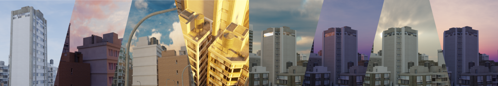

# LightCity: An Urban Dataset for Outdoor Inverse Rendering and Reconstruction

### [Project Page](https://23wjj.github.io/LightCity/) | [Paper](https://openaccess.thecvf.com/content/ICCV2025/papers/Wang_LightCity_An_Urban_Dataset_for_Outdoor_Inverse_Rendering_and_Reconstruction_ICCV_2025_paper.pdf) | [Dataset](https://huggingface.co/datasets/whalejj/LightCity)
<div align=center>

</div>

**Release Date:** November 26, 2025

- [x] Release data used in evaluation of the main paper.
- [ ] Release code for rendering and processing.
- [ ] Release data of the scenecity-based full urban region.
- [ ] Release expansion of the citygenerator-based.
- [ ] Weeather support.

## 1. Overview
**LightCity** is a high-quality synthetic urban dataset designed for outdoor inverse rendering and multi-illumination reconstruction tasks. It consists of diverse urban scenes constructed using high-fidelity assets (SceneCity), rendered to simulate complex outdoor lighting environments.

## 2. LightCity Dataset Structure
The dataset is organized to support multi-illumination research, including the LightCity Intrinsic dataset and the LightCity Reconstruction dataset.


### 2.1 LightCity Intrinsic Dataset
* **Multi-Illumination:** Each unique camera viewpoint is rendered under **8 different lighting conditions**.
* **Sequential Storage:** Images are stored sequentially. This means that every block of 8 consecutive images corresponds to the same static viewpoint, but with varying illumination.
For the reconstruction dataset:

The data is split into `train` and `test` directories.

#### File Naming Convention
Files are named using a numerical index (`[num_idx]`) followed by the component type.

| File Pattern | Format | Description |
| :--- | :--- | :--- |
| `[num_idx].png` | PNG | **RGB Composite:** The final rendered image combining all passes. |
| `[num_idx]_Albedo[postfix].png` | PNG | **Albedo:** The base color/diffuse texture map. |
| `[num_idx]_Shading[postfix].png` | PNG | **Shading:** The illumination component (light and shadow). |
| `[num_idx]_Normal[postfix].png` | PNG | **World Normal:** Surface normals in world space coordinates. |
| `[num_idx]_Depth[postfix].exr` | EXR | **Depth:** High-precision raw depth data. |

> **Note:** `[num_idx]` represents the unique image ID (e.g., `00001`, `00002`).

#### Metadata
The `jsons_intrinsics/` folder contains metadata files in JSON format. These files define the pairings between the raw RGB images and their corresponding ground truth intrinsic components (Albedo, Shading, etc.), facilitating easy data loading for training.

---

### 2.2 LightCity Reconstruction Dataset

The dataset is organized to support multi-illumination urban reconstruction. 
* **Urban Areas:** The current release primarily features four urban blocks: `E1`, `E2`, `F2`, and `F3`. additionally, area `C` represents a large-scale urban environment.
* **Viewpoint Sampling:** We employ three camera trajectory strategies:
    * `circle`: Circular trajectories around the scene.
    * `line`: Grid-pattern viewpoints.
    * `adaptive` / `street_aerial`: A hybrid approach fusing street-level and aerial perspectives.
* **Lighting Conditions:** Scenes are rendered under two lighting modes:
    * `multi`: Varying illumination across different views.
    * `same`: Constant illumination across all views.
* **Naming Convention:** Dataset folders follow the pattern: `[Area]_[Lighting]_[Viewpoint]` (e.g., `E1_multi_circle`).
* **Metadata**
    * `*.json`: Records the original rendering parameters and scene metadata.
    * `*.tsv`: Defines the data split for **train** and **test** sets.

#### File Structure

Each data folder contains the following subdirectories:

| Folder | Format | Description |
| :--- | :--- | :--- |
| `images` | PNG | **RGB Composite:** The final rendered images combining all passes. |
| `masks` | PNG | **Foreground Masks:** Binary masks separating the urban geometry from the sky and unbounded background. |
| `normals` | EXR | **World Normal:** High-precision surface normals in world space coordinates. |
| `sparse` | COLMAP | **Camera Parameters:** Standard COLMAP format (intrinsics, extrinsics) and initial point clouds. |
| (`pbrs`) | PNG | **PBR Materials:** (Available for selected subsets) Contains Metallic, Roughness, and Specular maps. |


---


## Citing
```
@inproceedings{wang2025lightcity,
  title={LightCity: An Urban Dataset for Outdoor Inverse Rendering and Reconstruction under Multi-illumination Conditions},
  author={Jingjing Wang, Qirui Hu, Chong Bao, Yuke Zhu, Hujun Bao, Zhaopeng Cui, Guofeng Zhang},
  booktitle={Proceedings of the IEEE/CVF International Conference on Computer Vision},
  year={2025}
}
```